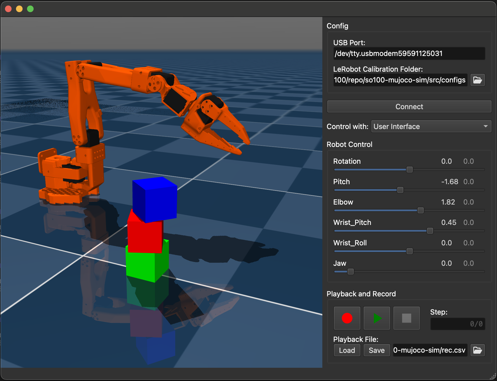

# so100 MuJoCo Simulation User Interface

User interface to simulate and drive the so100(so-arm100) robot arm. It supports the following:
- Control the arm (real and simulation) by independent joint angles in the user interface
- Control the simulation by moving the real robot
- Record the joint angles as the arm is controlled using one of the above methods
- Playback the recorded joint angle on the arm (real and simulation)

Ideally you have a so100 robot arm connected, but the application will still work fine without one.

## Dependencies

This project uses the [Pixi](https://pixi.sh/) package management tool, you will need to install this.

The application uses [MuJoCo](https://mujoco.org/) for simulation and visualisation of the robot arm. [PySide6](https://doc.qt.io/qtforpython-6/) (Qt) is used as the widget toolkit. Both these are installed during the pixi based getting started process below.

[LeRobot](https://github.com/huggingface/lerobot) is used to control the robot and also for the calibration process. LeRobot code is downloaded in the `pixi run download` step below.

# Robot setup

If you are connecting to a real so100 there a few steps that must first be carried out as per the [LeRobot tutorial](https://github.com/huggingface/lerobot/blob/main/examples/10_use_so100.md). If you just want to play with the sim, this part can be skipped.

1. Find the USB port associated with you robot arm ([see here](https://github.com/huggingface/lerobot/blob/main/examples/10_use_so100.md#1-find-the-usb-ports-associated-to-each-arm)). The USB port identified in this step must be entered into the user interface 'Config->USB Port'.
2. Your robot arm must be calibrated ([see here](https://github.com/huggingface/lerobot/blob/main/examples/10_use_so100.md#e-calibrate)). This step generates a calibration file that will account for differences in how your specific arm was assembled compared to the MuJoCo models reference. The location of the calibration file will be printed to stdout during this process, the full path to this **folder** must be added to the user interface 'Config->LeRobot Calibration Folder:'. The folder should include a file called 'main_follower.json'

## Getting started

Clone the repo

    git clone https://github.com/lachlanhurst/so100-mujoco-sim.git
    cd so100-mujoco-sim

Install dependencies

    pixi install

The following command will download LeRobot code and the so100 MuJoCo model files from the [MuJoCo Menagerie](https://github.com/google-deepmind/mujoco_menagerie) repo. This may take a little while as it downloads all models, then extracts only those for the so100.

    pixi run download

Run the simulation UI

    pixi run simulate

If connecting to a real so100 enter the config details from the [above steps](#robot-setup). Once this is done you can click 'Connect' to connect to the robot. **The simulation should then update to match the position of the real so100, if it does not then STOP**. Something isn't right attempting to move the robot via the application may cause the servos to move outside of the desired range.

## Running tests

Unit tests can be run with the following command

    pixi run tests

# Acknowledgements

Thanks to [TheRobotStudio for making such a great robot](https://github.com/TheRobotStudio/SO-ARM100)!
